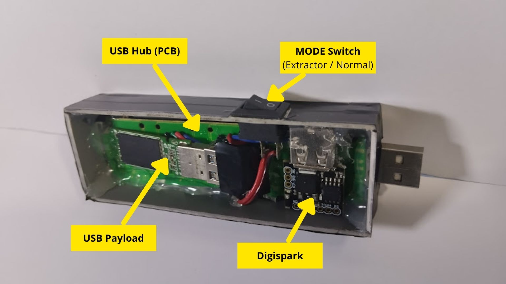

[English](README.md) | [Español](README.es.md)

# NyxUSB

Silent USB-based data extraction tool designed for educational and authorized security testing.

---

## 🖼️ Preview

> Current NyxUSB prototype (Digispark + USB + modified hub)

---

## 🧠 Description

NyxUSB is a hardware-based tool designed to automate data extraction from target systems in a silent and offline manner.

Inspired by Nyx, the goddess of the night, it operates without drawing attention and executes actions without user interaction.

---

## ⚙️ Architecture

NyxUSB is composed of three main components:

### 1. Digispark (Command Injector)
Acts as a HID device that simulates a keyboard and automatically executes commands on the target system.

### 2. USB Payload (Execution & Storage)
Contains a script (e.g., `.bat`) responsible for performing the data extraction process and storing the collected files.

### 3. Custom USB Hub (PCB)
A modified USB hub that allows both devices to operate simultaneously as a single unit.

---

## 🚀 How It Works

1. The device is plugged into the target machine  
2. The Digispark injects commands automatically  
3. The USB payload executes a silent extraction script  
4. Data is collected and stored on the USB device  

---

## 📦 Project Structure
digispark/
   - digispark_en.ino
   - digispark_es.ino

payloads/
   - extractor.bat

---

## 🔧 Requirements

To replicate this project, you will need:

- Digispark (ATtiny85)
- USB flash drive
- USB hub (modified or functional)
- Arduino IDE (to upload the code)
- Windows OS (for script execution)

---

## 🛠️ Setup / Usage

### 1. Prepare the Digispark
- Open Arduino IDE
- Load the appropriate file:
  - `digispark_en.ino` (English keyboard layout)
  - `digispark_es.ino` (Spanish keyboard layout)
- Upload the code to the Digispark

### 2. Prepare the USB
- Copy `extractor.bat` to the root of the USB drive
- (Optional) Set the USB volume label according to the script

### 3. Use the device
- Plug NyxUSB into the target system
- Activate extractor mode (if applicable)
- The process will execute automatically

---

## 🌍 Multi-language Support

NyxUSB includes support for both English and Spanish keyboard layouts.

HID-based payloads depend on keyboard layout, which can cause compatibility issues across different systems.

This project provides adapted versions for both environments, ensuring proper functionality without additional modifications.

---

## 🧪 Demo / Result

  

---

## 🧩 Extensions and Payloads

NyxUSB is not limited to file extraction.

Its design allows adding new scripts inside the `payloads/` folder, expanding its capabilities.

Possible use cases include:
- Task automation
- Custom script execution
- Security testing scenarios

---

## ⚠️ Disclaimer

This project is intended for educational purposes and authorized security testing only.

Do not use this tool on systems without explicit permission.

---

## 🤝 Ideas & Contributions

If you have ideas for new payloads, improvements, or similar hardware projects:

- Feel free to open an issue
- Or share your ideas

---

## ⭐ Support

If you find this project interesting, consider giving it a star ⭐ on GitHub.
